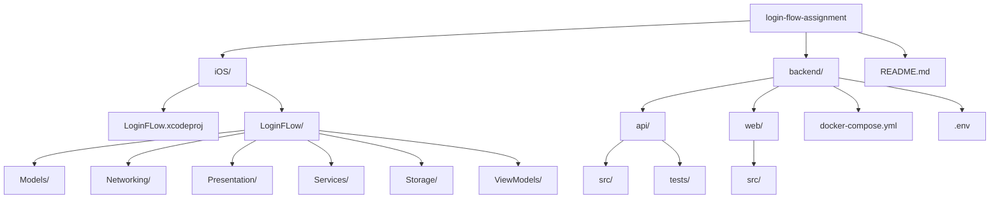

# Login Flow Assignment

This repository is a monorepo with two main applications:

- `iOS/`: SwiftUI iOS client using MVVM and Alamofire
- `backend/`: Node.js backend API plus a Vite React demo app

The backend exposes JWT-based authentication APIs, and the iOS app consumes them for signup, login, session restore, and profile fetch.

## Tech stack

- iOS app: SwiftUI, MVVM, Alamofire, Keychain
- Backend API: Node.js, Express, MongoDB, JWT
- Web demo: React with Vite
- Local orchestration: Docker Compose

## Repository structure



## Prerequisites

Make sure these are installed before running the project:

- macOS with Xcode installed
- Xcode version new enough to open the project in `iOS/`
- iOS Simulator support installed from Xcode
- Docker Desktop
- Git

Optional, only if you want to run backend services without Docker:

- Node.js 20+
- npm 10+
- A local MongoDB instance

## Environment setup

The backend reads configuration from `backend/.env`.

Important values:

- `PORT`
- `MONGO_URI`
- `JWT_SECRET`
- `JWT_EXPIRES_IN`
- `CLIENT_ORIGIN`
- `VITE_API_URL`
- `DEFAULT_USER_NAME`
- `DEFAULT_USER_EMAIL`
- `DEFAULT_USER_PASSWORD`

The default user is seeded automatically when the API starts for the first time against a database that does not already contain that email. If the user already exists, the seed step is skipped.

## Install commands

### Option 1: Recommended, using Docker

No manual package installation is required on the backend. Docker builds the API and Vite app containers for you.

```bash
cd backend
docker compose up --build
```

### Option 2: Run backend manually without Docker

Install dependencies:

```bash
cd backend/api
npm install

cd ../web
npm install
```

## How to run locally

### 1. Start the backend

Recommended:

```bash
cd backend
docker compose up --build
```

This starts:

- MongoDB on `localhost:27017`
- API on `http://localhost:4000`
- Web demo on `http://localhost:5173`

### 2. Run the iOS app

Open the iOS project:

```bash
open iOS/LoginFLow.xcodeproj
```

Then in Xcode:

1. Select the `LoginFLow` scheme
2. Select an iPhone simulator
3. Build and run the app

If Swift packages are not resolved automatically, in Xcode use:

1. `File` -> `Packages` -> `Resolve Package Versions`

## Regular developer commands

### Backend with Docker

Start:

```bash
cd backend
docker compose up --build
```

Stop:

```bash
cd backend
docker compose down
```

Stop and remove volumes:

```bash
cd backend
docker compose down -v
```

### Backend without Docker

Run the API:

```bash
cd backend/api
npm run dev
```

Run the web app:

```bash
cd backend/web
npm run dev
```

Run backend tests:

```bash
cd backend/api
npm test
```

### iOS build from terminal

Open in Xcode for the simplest workflow, but if needed you can build from terminal:

```bash
xcodebuild -project iOS/LoginFLow.xcodeproj -scheme LoginFLow -destination 'generic/platform=iOS' CODE_SIGNING_ALLOWED=NO build
```

## Local usage flow

1. Start the backend stack
2. Wait for MongoDB and the API to come up
3. Confirm the React demo opens at `http://localhost:5173`
4. Run the iOS app from Xcode
5. Sign up or log in with the seeded default user from `backend/.env`

Default seeded credentials currently set in `backend/.env`:

- Email: `demo@example.com`
- Password: `password123`

## Notes

- The iOS app points to the local API base URL on `http://127.0.0.1:4000/api`
- On a physical iPhone, `127.0.0.1` will refer to the phone itself, not your Mac. For device testing, update the base URL to your machine IP.
- The backend and frontend live together in this monorepo, so changes to API contracts and client behavior can be developed together.
